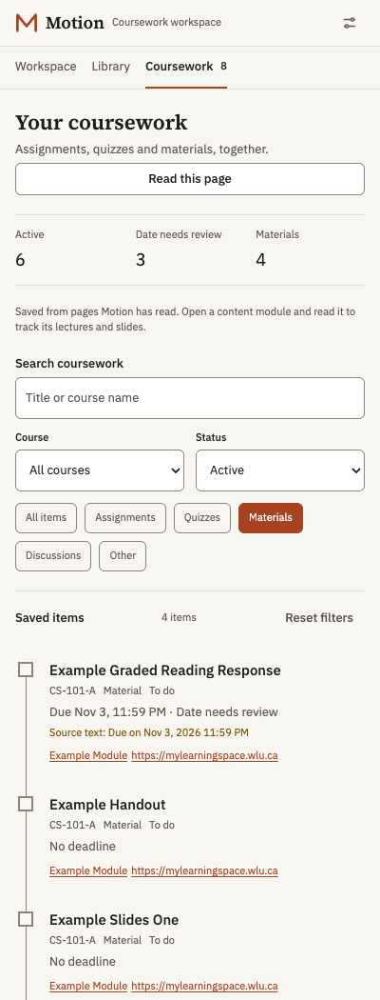
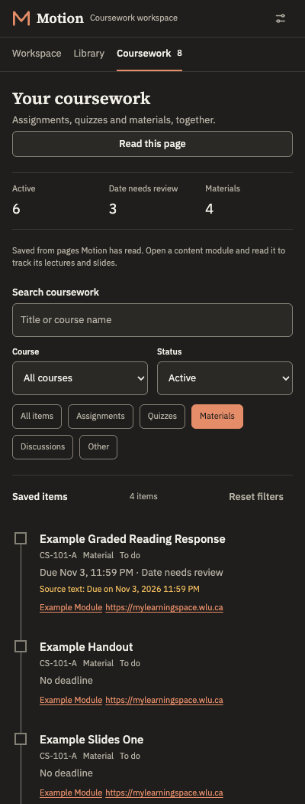

# Coursework overview and MyLearningSpace verification

Verification completed on 2026-10-03. All committed fixtures, screenshots and
automated browser data are synthetic. No authenticated course records or
identifiers are retained in this repository.

## Verified behaviour

The saved-coursework view searches titles and courses, filters by course, type
and status, and links back to the page where each item was observed. It remains
available away from an LMS. Lecture slides and handouts without a stated date
say **No deadline** and do not appear as failed date parses or overdue work.
Submitted, graded and archived items do not contribute to active deadline counts.
Date conflicts remain reviewable. Results render 40 at a time; extraction keeps
the existing 500-task boundary, prioritizes date evidence and reports omitted
items. A content-free revision refreshes the panel after database writes finish.

Brightspace dashboard links and native actor controls are discovered through
nested open shadow roots. Traversal is bounded, labels use their own root and
rendered slots, and actors revalidate the same connected document, visibility
and fingerprint before dispatch. Closed roots and iframe documents are outside
this coverage. Observer, actor and deadline discovery checks include bounded
visible shadow text before reading or acting. Assessment destinations are
refused even when a generic click received approval.

## Authenticated MyLearningSpace inspection

After the student signed in, read-only inspection of the dashboard showed course
card anchors nested through six open shadow roots. A light-DOM-only query found
no course anchors; traversal through open roots found them. A course's lecture
module used native `viewContent` anchors inside `d2l-datalist-item` rows without
date wrappers, matching the synthetic module fixture. Only structural facts
were recorded. No quiz attempt was opened and no coursework was submitted.

The in-app browser used for authenticated inspection cannot load Motion's MV3
extension. Live markup was inspected there; extension execution was verified
separately in isolated Chromium against synthetic pages. A complete installed
extension run against the authenticated account remains unverified.

## Automated evidence

| Check | Result |
| --- | --- |
| `npm run typecheck` | Passed |
| `npm test` | 85 files, 1,114 tests passed |
| `npm run lint` | Passed |
| `npm run build` | Passed; worker bundle free of DOM globals |
| `npm run test:extension` | 68/68 checks passed |
| `npm run test:agent` | 45/45 checks passed; optional real-provider stream/cancel branch skipped by headless permission behaviour |
| `npm run test:popup-presence` | 6/6 checks passed |
| `npm run test:coursework` with axe | 18/18 checks passed, including zero scoped light/dark violations |
| `npm run build:e2e-provider-hosts` and `npm run test:provider-stream` | Passed; 16/16 local synthetic provider checks |
| `npm run test:release` | 15/15 tests passed |
| `npm run test:keychain` | 12 tests passed |
| `npm run package` and `npm run package:keychain` | Passed; extension ZIP (33 files) and companion ZIP (4 files) passed standard CRC checks |

The model-turn concurrency test now waits for its synthetic stream to enter
before checking that a second turn is blocked. Its earlier polling could observe
the durable claim before the first stream started. The agent Release test returns
from its deliberately restricted attempt to a supported assignment before
expecting workspace controls. Both retain their original safety assertions.

The build emits an existing Vite notice about a future native configuration
loader's extensionless import; it does not fail the current build.

The coursework browser script covers saved extraction, live panel refresh,
filters, search recovery, persistence, source availability away from the LMS,
keyboard focus and skip navigation, narrow reflow and restricted-mode removal.
The shadow actor browser flow covers a six-root course card and a
worker-authorized field update with presence and native event propagation.

Optional accessibility and screenshot checks can be reproduced with:

```bash
MOTION_AXE_PATH=/absolute/path/to/axe.min.js \
MOTION_SCREENSHOTS_DIR=docs/verification/screenshots \
npm run test:coursework
```

The audit uses axe-core without adding it to Motion's runtime or dependencies.
It checks the rendered light and dark coursework view against WCAG 2 A/AA,
WCAG 2.1/2.2 AA and best-practice tags. This is a scoped automated audit, not a
claim of complete accessibility conformance.

## Remaining limits

- Materials are collected from observed modules/topics. There is no whole-course
  lecture crawl. The follow-up [document verification](document-indexing.md) records
  local PDF/PPTX text indexing and its separate browser/live-account evidence.
- No new host permission, closed-root access, iframe traversal or arbitrary
  script/selector action was added.
- Provider-backed study and drafting remain subject to the existing disclosure,
  consent and assessment gates; this change does not verify real provider inference.
- Release packaging and publication transitions have local synthetic tests.
  Actual GitHub publication must be verified after merge or a matching version tag.

## Screenshots

The screenshots below come from the production extension using invented data.




