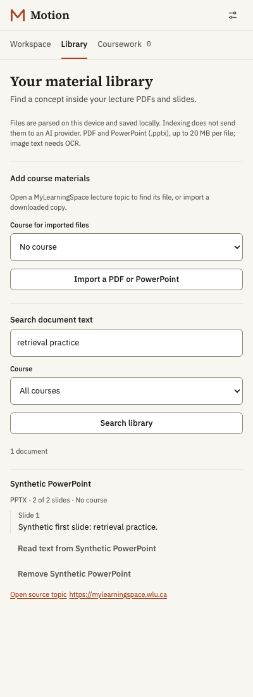
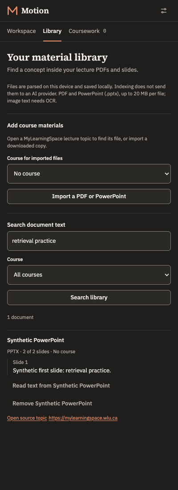

# Local document indexing verification

Verified on 2026-10-04. Committed fixtures and screenshots contain synthetic
material. This follow-up adds PDF/PPTX text indexing to the earlier
[coursework and MyLearningSpace work](coursework-overview.md).

## Verified behaviour

Library imports selectable PDF text and PowerPoint (.pptx) slide text with
bundled local workers. Search returns page/slide references and bounded text
snippets; the text preview starts on the matching unit and receives keyboard
focus. Students can associate local files with a course, reindex an observed
LMS file, retain indexes across panel reloads and remove individual indexes.
Indexing does not send files or text to a provider.

The production extension ran in a temporary Chromium profile with external
networking blocked. Synthetic MyLearningSpace responses exercised observed
PDF.js viewer references and direct PPTX links through the content observer,
worker-issued source handle, bounded credentialed fetch, parser and local store.
Tests verified source/topic provenance, Unicode, presentation relationship
order, deduplication and excluded speaker notes. Image-only files disclose
missing text; corrupt PDFs and unsafe slide XML create no index.

Data deletion was tested in that browser: all indexes disappeared and the open
library refreshed to an empty state. An import ticket issued before deletion could not recreate
data. A synthetic graded attempt removed library/text/import controls and the
worker refused document sources. No real assessment attempt was opened.

## Private lecture and authenticated-account checks

A lecture PDF was downloaded through the authenticated MyLearningSpace browser
and then imported into the built extension's isolated temporary profile. It
indexed **22/22 pages and 11,741 characters**. Only these counts were recorded;
the file, extracted text, student details and real course identifiers are absent
from repository fixtures, logs and screenshots. Its index and temporary profile
were removed after verification. Screenshots were captured before this import.

The first installed-account attempt found an older build and worker. Current
artifacts were staged in the existing installed folder with backups. Browser
control refused the extension-manager URL; the student updated the extension
manually. No profile or cookie transfer was used. After refreshing the lecture
page, the installed worker and content observer responded normally.

The installed extension then passed a read-only check of one signed-in course:

- **Authenticated PDF download:** Library discovered the embedded viewer's
  observed file, downloaded it through Motion and indexed **22/22 pages**.
  Its source link retained the actual lecture topic.
- **Search and text:** a concept returned three page references, including a
  later page. That page's preview contained the original PDF viewer's selectable
  text after whitespace normalization.
- **Course and persistence:** reading the lecture saved its course and one
  undated material. Reindexing associated the previously unassigned PDF with
  that course without adding a duplicate. Its index survived closing and
  reopening Motion, navigation to content and the dashboard.
- **Content and assignments:** the content module read successfully. Reading
  the assignment list saved three entries; all three titles matched its visible
  rows. Status filters and uncertain-date labels remained available.
- **Quiz list:** its single visible quiz was saved with a matching title. The
  list stayed readable; no quiz link or attempt was opened.
- **Dashboard:** reading the main dashboard retained five saved coursework
  items and one document, without inventing dashboard tasks. Workspace cleared
  the previous course prefix. An expired LMS session renewed through its normal
  login link and page refresh, without credentials entering diagnostics.

This check also exposed a reader control disappearing after the first saved
material. Workspace and Coursework now retain **Read this page** on supported
pages with saved records. The installed panel read the content, assignment,
quiz-list and dashboard pages through that control. Unit and built-browser
regressions cover its availability; busy state disables the new control.

Real saved items and the lecture index remain in the student's extension.
Committed evidence contains route shapes, counts and booleans, with synthetic
screenshots only. No real assessment or consequential course action was
performed. This verifies the exercised routes in one course, not every course,
LMS configuration, private PowerPoint file or provider-backed action. The
[manual checklist](../MANUAL-TESTING.md#local-document-library) records the steps.

## Automated evidence

| Check                                                  | Result                                                                                               |
| ------------------------------------------------------ | ---------------------------------------------------------------------------------------------------- |
| `npm run typecheck`                                    | Passed                                                                                               |
| `npm test`                                             | 95 files, 1,253 tests passed                                                                         |
| `npm run lint`                                         | Passed                                                                                               |
| `npm run build`                                        | Passed; service-worker AST check rejects DOM globals                                                 |
| `npm run test:documents` with axe                      | 25/25 checks passed                                                                                  |
| `npm run test:extension`                               | 68/68 checks passed                                                                                  |
| `npm run test:agent`                                   | 45/45 checks passed; optional real-provider stream branch skipped by headless permissions            |
| `npm run test:popup-presence`                          | 6/6 checks passed                                                                                    |
| `npm run test:coursework` with axe                     | 20/20 checks passed                                                                                  |
| Provider test build and `npm run test:provider-stream` | 16/16 local synthetic provider checks passed                                                         |
| `npm run test:release`                                 | 17 tests passed                                                                                      |
| `npm run test:keychain`                                | 12 tests passed                                                                                      |
| Extension and companion packaging                      | Passed; 39-file extension and 4-file companion ZIPs passed CRC checks; parser license texts included |

Library and Coursework light/dark views had zero scoped axe violations for WCAG
2 A/AA, WCAG 2.1/2.2 AA and best-practice tags. Library reflow passed at 360px
and 180px. These automated checks do not establish full accessibility conformance.
The existing Vite future-config-loader notice remains non-failing.

Boundary tests cover worker deadlines and cancellation, Chromium 125 PDF gating,
malformed payloads, ZIP size/inflation/CRC limits, strict XML, course identity,
assessment refusal, stale page handles, deletion epochs, schema migration and
concurrent library capacity. The deferred-tab cancellation regression proves
that cancellation stops the credentialed download from starting.

## Reproduction and limits

```bash
npm ci
npm run build
npm run test:documents
```

For the optional accessibility audit and synthetic screenshots:

```bash
MOTION_AXE_PATH=/absolute/path/to/axe.min.js \
MOTION_SCREENSHOTS_DIR=docs/verification/screenshots \
npm run test:documents
```

`MOTION_REAL_DOCUMENT_PATH` optionally adds a downloaded private PDF after the
synthetic screenshots. It logs only counts and deletes the temporary profile.
The normal document CI path has 23 checks; axe adds two and the private-file
probe adds one. The earlier private-file run passed 26/26 checks. Coursework
has 18 normal checks, plus two optional theme audits. CI does not receive real
lecture files or authenticated credentials.

Limits are 20 MB, 30 seconds, 200 pages/slides, 200,000 total characters,
12,000 characters per unit and 100 saved indexes. PDF indexing needs Chromium
125+; the extension shell and PPTX path retain the Chrome 116 minimum. There
is no OCR, legacy `.ppt`, visual reconstruction, speaker-note indexing or
automatic whole-course crawl. Real provider inference and actual GitHub release
publication remain separate verification work.

## Screenshots

Production extension with synthetic lecture material:




